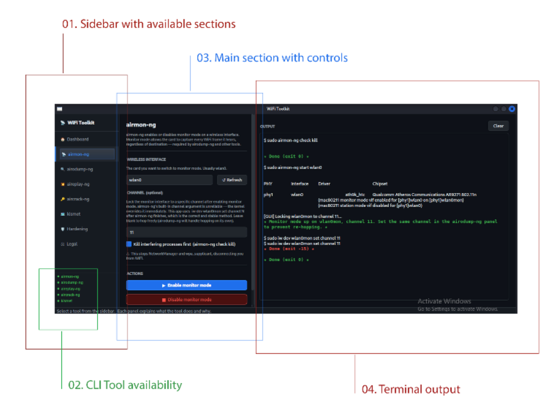

# WiFi Toolkit
A guided educational interface for wireless security tools

[**Legal & Educational Disclaimer**](DISCLAIMER.md)

## App overview
An educational, guided interface for learning wireless security tools.
- Users are prompted with a legal disclaimer before being able to access the tools
- Includes preliminary checks of available cli tools, wifi card capabilities and target network settings
- Includes Kismet IDS for monitoring
- The GUI is light and easy to understand, the terminal output is not hidden – but explained

## Workflow
In order to demonstrate a Deauth Attack complete with WPA2 Handshake retrieval and password discovery, one will use the following tools inside the toolkit:

1. **Airmon-ng** - > put the wireless card into monitor mode 
2. **Airodump-ng** -> scan and discover APs and Clients, capture the WPA handshake
3. **Aireplay-ng** -> send deauth frames in order to force a WPA handshake 
4. **Aircrack-ng** -> crack the password from the captured handshake

## Other Features
1. **Injection test** - tests whether the network card has injection capabilities
2. **PMF Test** - test whether the target network uses PMF
3. **Kismet IDS** - intrusion detection and alerts based on kismet

